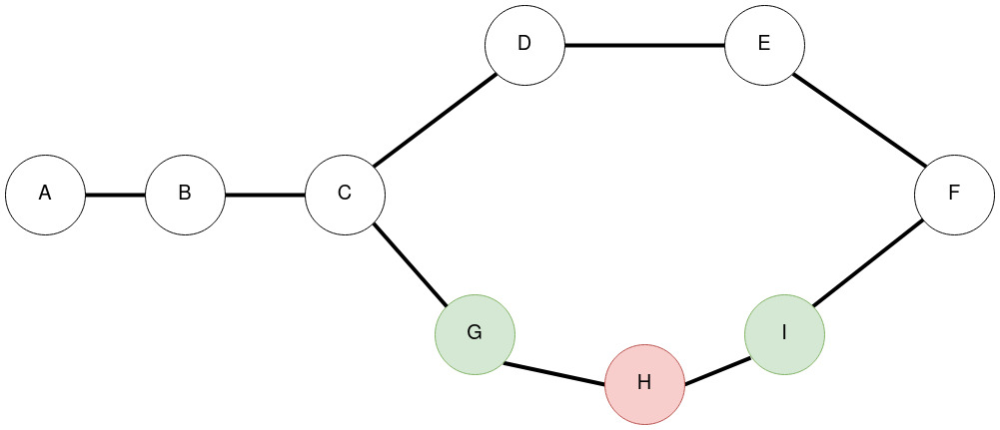
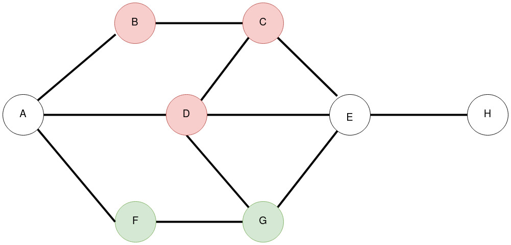
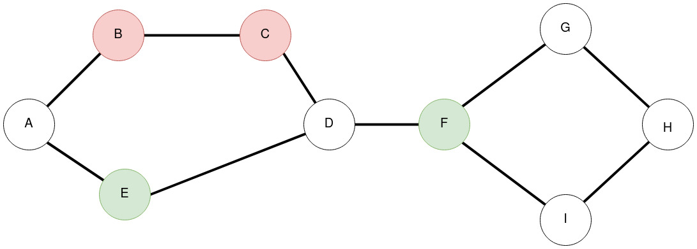

# Tarea Buda - Metro

Entrega todos el o los caminos mas cortos entre dos estaciones para una red de metro que puede tener distintos colores para evitar ciertas estaciones.
## Como ejecutar
En la carpeta raiz ejecutar: 
    
    ruby main.rb <input.txt> <start> <destination> <color>

Donde:
- `input.txt`: Archivo de texto que representa la red de metro.
- `start`: Nombre de la estacion de inicio
- `destination`: Nombre de la estacion de destino
- `color`: (Opcional) Color del metro para la busqueda del camino más corto.

ej.: 
    
    ruby main.rb inputs/input_0.txt a f red

---

## Como modelar una red de metro
El archivo de input debe de contener las conexiones entre las distintas estaciones, por ejemplo, si se tienen 3 estaciones conectadas secuencialmente el archivo debe ser:

    estacion_1 estacion_2
    estacion_2 estacion_3

Adicionalmente se le puede incluir un color a las estaciones en cualquier linea del archivo, donde solo se aceptarán valores `green` o `red`.

    estacion_1 estacion_2 color_estacion_1 color_estacion_2
    estacion_2 estacion_3 color_estacion_2 color_estacion_3

En el ejemplo anterior, si la `estacion_2` es de color roja, el archivo input sería:

    estacion_1 estacion_2 - red
    estacion_2 estacion_3 red

Que es equivalente a:

    estacion_1 estacion_2 
    estacion_2 estacion_3 red

__Nota:__ Se tomará como color final el ultimo color valido de la estacion en el archivo. 

---

## Archivos de prueba
Se incluyen 3 archivos de prueba en la carpeta `inputs`, que representan a las siguientes redes de metro:

1. `inputs/input_1.txt`

2. `inputs/input_2.txt`

3. `inputs/input_3.txt`

---

## Test
Se incluyen dos tipos de test unitarios en el archivo `test.rb`. Para ejecutar los test se debe correr:

    ruby test.rb

Los test son:

1. Verificar la creacion de las estaciones correctamente:
    
    Para esto se busca que las estaciones no estén repetidas independiente de cuantas veces se declare en el archivo de input, ya que solo se deberia crear cada una, una única vez y luego buscar la instancia para actualizar en caso de ser necesario. 

2. Verificar que las conexiones entre estaciones esté correcta:

    Para esto se busca que todas las conexiones del archivo input se hayan leido y creado correctamente. Tambien, como las conexiones de cada estación se guardan en un arreglo de instancias de `Station`, se verifica que el contenido estas instancias sean consistentes entre los distintos arreglos, si se cambia el color de una estación en la creacion por ejemplo.
    

Para ambos tipos de test se toman en cuenta dos escenarios, uno que representa una conexion simple de tres estaciones (`tests/test_0.txt`) y el otro que representa una estación con ciclo (`tests/test_1.txt`).